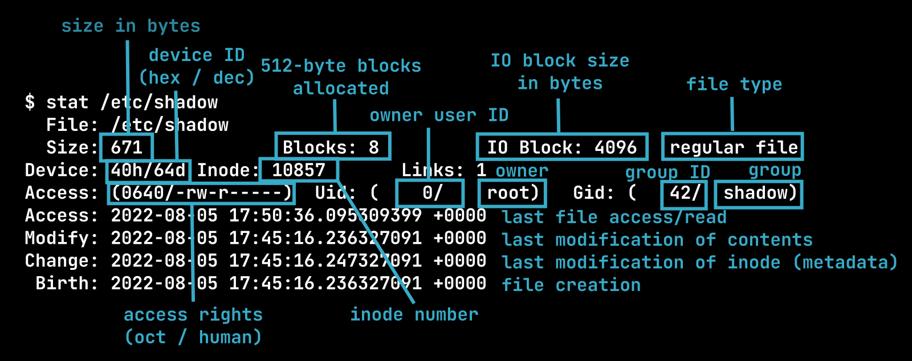

# §4: Working with files

---

- Everything is a file.
  A directory or device is also a special kind of file.
- Common file systems: ext4, Btrfs.
- **Symbolic links**: pointers to files.
- File names: 255 bytes max, case-sensitive.
- Path separator is `/`.
- `.` is the current directory and `..` is the parent directory.

---

## Stat 🔬

```
user@cosmos:~$ stat /etc/shadow
  File: /etc/shadow
  Size: 671             Blocks: 8          IO Block: 4096   regular file
Device: 40h/64d Inode: 10857       Links: 1
Access: (0640/-rw-r-----)  Uid: (    0/    root)   Gid: (   42/  shadow)
Access: 2022-08-05 17:50:36.095309399 +0000
Modify: 2022-08-05 17:45:16.236327091 +0000
Change: 2022-08-05 17:45:16.247327091 +0000
 Birth: 2022-08-05 17:45:16.236327091 +0000
```

---



---

```
user@cosmos:~$ stat --format=%F /etc/passwd
regular file
user@cosmos:~$ stat --format=%F /home
directory
user@cosmos:~$ stat --format=%F /proc/1/exe
symbolic link
user@cosmos:~$ stat --format=%F /dev/tty
character special file
```

As you see,

`/etc/passwd`,
`/home`,
`/proc/1/exe`,
`/dev/tty`

are all files, but of different kind.

---

| Command                | Action                              |
|------------------------|-------------------------------------|
| `pwd`                  | print working directory             |
| `ls`                   | list files in the working directory |
| `tree`                 | print file tree (package `tree`)    |
| `ls foo`               | list files in `foo`                 |
| `cd foo`               | go to `foo` directory               |
| `cd`                   | go to your home directory           |

---

## Some options of ls ⚙

- `-1` : one file per line,
- `-a`, `--all` : show hidden files,
- `-h`, `--human-readable` : human-readable size,
- `-l` : long listing format,
- `-p` : append `/` to directories,
- `-R`, `--recursive` : recursive list,
- `-S` : sort by size, largest first,
- `-t` : sort by time, newest first,
- `-r`, `--reverse` : reverse sort.

```
user@cosmos:~$ ls -1ahlp /etc
```

---

## Hidden files 🫣

- By convention, files starting with `.` are hidden.

```
user@cosmos:~$ ls -1 
user@cosmos:~$ ls -1a
.
..
.bash_history
.bash_logout
.bashrc
.profile
```

---

## Hidden files 🫣

- Used to store local settings and configuration.

- Bash will have these in your home dir:
  `.bash_history`,
  `.bash_logout`,
  `.bashrc`,
  `.profile`
  (second session).

- Familiar example: Git stores its local data in `.git`.

- Your IDE configuration is in
  `/home/user/.vscode`, `/home/user/.idea`, etc.

---

| Command                | Action                       |
|------------------------|------------------------------|
| `mkdir foo`            | create directory `foo`       |
| `mkdir -p foo/bar/baz` | create together with parents |
| `mv foo bar`           | move `foo` to `bar`          |
| `cp foo bar`           | copy `foo` to `bar`          |
| `cp -r ./foo/ bar`     | copy directories recursively |
| `rm foo.txt`           | delete `foo.txt`             |
| `rm -r ./foo/`         | delete `foo` recursively     |
| `ln -s source target`  | create symbolic link         |
| `touch foo.txt`        | modify / create file         |

---

## Symbolic links 🔗

- **Hard links** share inode; point to a specific part of the file system.

- **Soft (symbolic) liks** are separate inodes refering to another path.

- Example use: if you install Java on Debian (package `default-jdk`),
  you'll have symbolic links

  `/usr/bin/java` →
  `/etc/alternatives/java` →
  `/usr/lib/jvm/java-11-openjdk-amd64/bin/java`

---

## Dangling links ⛔

```
user@cosmos:~$ touch foo.txt
user@cosmos:~$ ln -s foo.txt bar.txt
user@cosmos:~$ ls -1l
total 4
lrwxrwxrwx 1 user user 7 Aug  8 20:34 bar.txt -> foo.txt
-rw-r--r-- 1 user user 0 Aug  8 20:34 foo.txt
user@cosmos:~$ rm foo.txt 
user@cosmos:~$ ls -1l
total 4
lrwxrwxrwx 1 user user 7 Aug  8 20:34 bar.txt -> foo.txt
user@cosmos:~$ cat bar.txt 
cat: bar.txt: No such file or directory
```

---

## Viewing files 👀

| Command            | Action             |
|--------------------|--------------------|
| `cat file ...`     | concatenate files  |
| `less foo.txt`     | view interactively |
| `head foo.txt`     | view first lines   |
| `tail foo.txt`     | view last lines    |
| `tail -f log.txt`  | watch for updates  |

\* `sudo apt install less`

---

## Finding files 🔍

- `find` : finds files in a directory.

- Finding file by name:

```
user@cosmos:~$ find /usr -name *.txt
/usr/share/doc/libdb5.3/build_signature_amd64.txt
/usr/share/doc/mount/mount.txt
/usr/share/doc/util-linux/00-about-docs.txt
/usr/share/doc/util-linux/PAM-configuration.txt
/usr/share/doc/util-linux/blkid.txt
. . . . .
```

---

## Grepping through contents 🔍

- Read `man grep`.
- `-r`, `--recursive` for recursive search,
- `-i`, `--ignore-case` to ignore case.

```
user@cosmos:~$ grep -r -i torvalds /usr
/usr/share/doc/bsdutils/copyright:           1991, 1992 Linus Torvalds
/usr/share/doc/bsdutils/copyright:Copyright: 1991, 1992 Linus Torvalds
/usr/share/doc/libblkid1/copyright:           1991, 1992 Linus Torvalds
/usr/share/doc/libblkid1/copyright:Copyright: 1991, 1992 Linus Torvalds
/usr/share/doc/libmount1/copyright:           1991, 1992 Linus Torvalds
```

---

## du: disk usage 📂

- Directory size reported by `ls` and `stat`: possibly not what you want.
- Actual recursive size of contents: `du` (disk usage).

  - `-h`, `--human-readable`,
  - `-s`, `--summarize` : display total size.

```
user@cosmos:~$ stat --format=%s /usr
84
user@cosmos:~$ du -sh /usr
136M    /usr
```

---

## df: disk space 💿

```
user@cosmos:~$ df -h
Filesystem      Size  Used Avail Use% Mounted on
/dev/vdb         50G   46G  4.2G  92% /
tmpfs            64M     0   64M   0% /dev
tmpfs           3.3G     0  3.3G   0% /sys/fs/cgroup
shm              64M     0   64M   0% /dev/shm
/dev/vdb         50G   46G  4.2G  92% /etc/hosts
devtmpfs        3.3G     0  3.3G   0% /dev/tty
tmpfs           3.3G     0  3.3G   0% /proc/asound
tmpfs           3.3G     0  3.3G   0% /proc/acpi
tmpfs           3.3G     0  3.3G   0% /proc/scsi
tmpfs           3.3G     0  3.3G   0% /sys/firmware
```

---

## Working with archives 📦

| Command                             | Action                    |
|-------------------------------------|---------------------------|
| `zip -r files.zip files`            | create `.zip` acrchive    |
| `unzip files.zip -d /path/to/unzip` | extract `.zip` archive    |
| `unzip -l files.zip`                | list contents             |
| `tar -czvf files.tar.gz files`      | create `.tar.gz` archive  |
| `tar -xvf files.tar.gz`             | extract archive           |
| `tar -tvf files.tar.gz`             | list contents             |

---

## What is `.tar.gz`? 📦

- An **archive** packages files together.

  `.tar` = "tape archive" format.

- **Compression** is applied to an archive.

  `.gz`, `.bz2`, `.lz`, `.xz`, ... = different compression algorithms.

- `tar` command is already aware of those formats applied to `.tar`.

---

## Other useful commands 🔮

| Command                    | Action                           |
|----------------------------|----------------------------------|
| `sort foo.txt`             | sort lines and print to stdout   |
| `sort -u foo.txt`          | sort lines, print unique entries |
| `diff foo.txt bar.txt`     | compare files                    |
| `sed s/foo/bar/g text.txt` | pattern substitution             |
| `wc`                       | count words, lines, bytes        |

---

Count installed packages:

```
user@cosmos:~$ apt list --installed | wc -l
```

---


