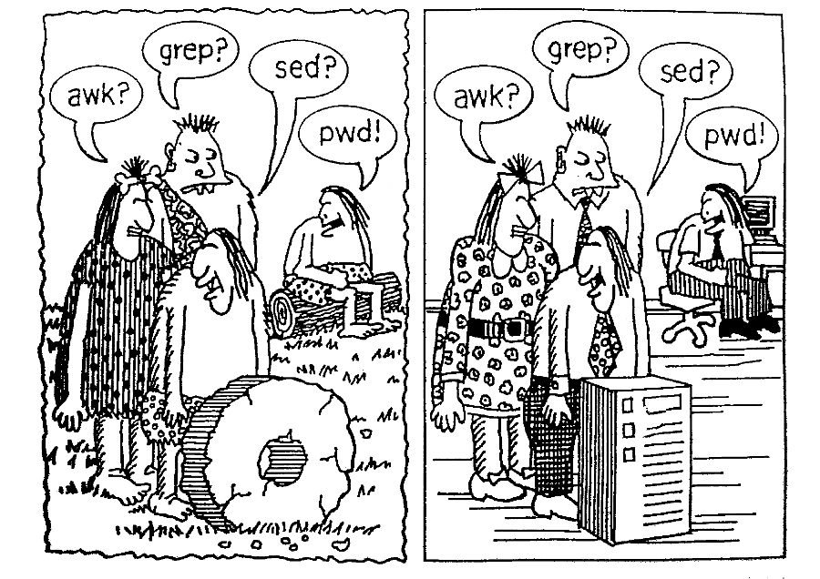

# GNU/Linux Tutorial



In this tutorial we are going to cover some basics of GNU/Linux systems,
working from the command line. We'll start with some basic commands,
structure of the file system, file permissions, and so on... There will be
probably two sessions of one hour each.


## Part I

[All slides in one .pdf](./session-1.pdf)

1. [GNU, Linux, and distributions](./01-debian.md)
2. [First practice](./02-first-practice.md)
3. [Getting help with man and installing packages with APT](./03-apt.md)
4. [Working with files](./04-files.md)


## Part II (tentative)

- Users, groups, permissions.
- Processes (commands `ps`, `top`, `kill`, `killall`).
- Linux file system: what is `/bin`, `/dev`, `/boot`, `/etc`, and so on.
- IO redirection and pipelines.
- Pattern matching, alisases, variables, `$PATH`.
- Anatomy of scripts: shebang.
- Using `systemctl`. E.g. let's setup and monitor `nginx`.
- Working with `ssh` and certificates.


## How to setup a Docker image

You might already have some UNIX-like system at hand, but we want to make sure
that everyone has the same environment and doesn't mess with their real system.

So we are going to use **[Debian GNU/Linux](https://www.debian.org/)**,
in particular its latest version **Bullseye**. We will run the Docker image
```
debian:bullseye
```
Here you can check the official Docker images for Debian:
https://hub.docker.com/_/debian


### Get started

Get [Docker](https://www.docker.com/) working on your system
and review some basics of using Docker on https://docs.docker.com/

Below I list `docker` commands to be executed. All of them require `root`
privileges, so if you're already on Linux, it should be always `sudo docker ...`


### Build a custom image

We want to prepare our own image that has a non-root user
(later we'll see what that means).

For this build the image from [debian-playground/](./debian-playground/)

It is based on the `debian:bullseye` image.

First, feel free to replace `user` in the `Dockerfile` with your preferred
username, and password `qwerty` with something else.

Here is how you build the image:

```shell
cd debian-playground
docker build -t debian-playground .
```

### Check if everything works

Now you should be able to run the new image `debian-playground` with
```shell
docker run -it --hostname cosmos --name debian_container debian-playground
```

You will see the command line prompt `user@cosmos:~$`.
Instead of `cosmos`, you may put any hostname you like.

For the moment, just type `exit` to exit the container.

### Going back to the container

When we execute `exit`, our container gets stopped. To list all containers, do

```shell
docker container ls -a
```

This means that our `debian-playground` image is in the container named
`eloquent_brattain`, and we are running `bash` shell in there.

To get back to the same container, we do
```shell
docker start -i debian_container
```

We will continue working in that container, setting up and exploring our Linux
system.
